% Alba Marina Málaga Sabogal
% Audition pour le poste MCF 4064\newline «Calcul scientifique, réalité virtuelle, réalité augmentée»
% 26 mai 2020

## Parcours

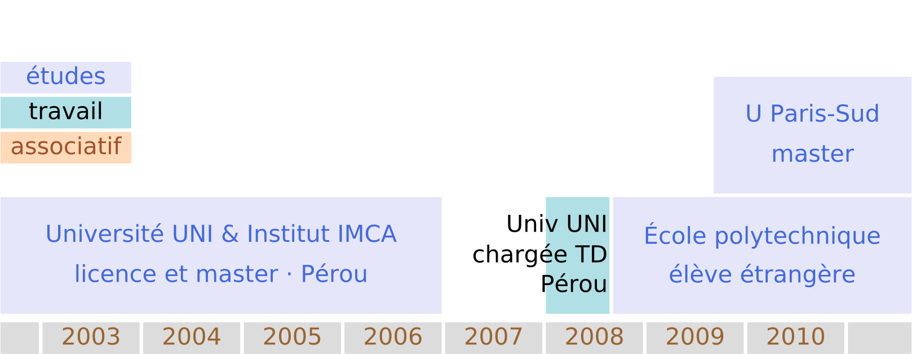{width=90%}

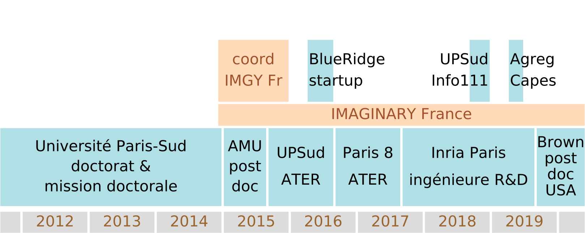{width=90%}

## Systèmes dynamiques

Les billards, les cylindres discrets et les escaliers
:   \centering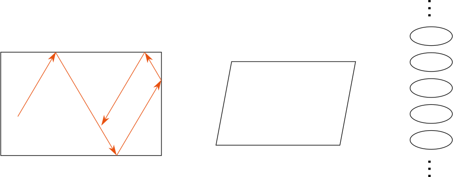{height=25%}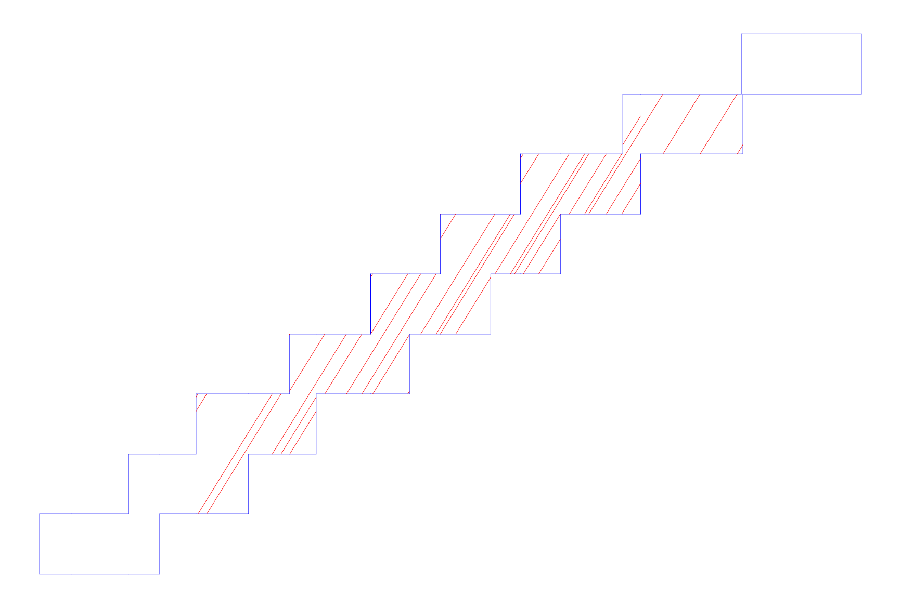{height=25%}\par

La saga des Wind-trees  
:   \centering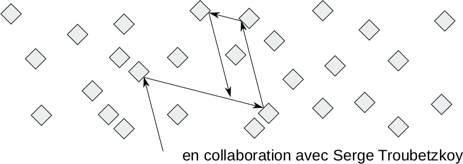{height=25%}\par

## Ma thèse

J'ai soutenu en 2014 à Orsay une thèse de doctorat intitulée

*Étude d'une famille de transformations\
préservant la mesure de $ℤ × 𝕋$.*

sous la direction de Jean-Christophe Yoccoz (Collège de France).

Résultats sur $ℤ × 𝕋$ $\longleftrightarrow$ escaliers infinis.

**Thm** (2014) Direction fixée, escalier générique: \
dynamique conservative, minimale et ergodique.

## Mes travaux avec Serge Troubetzkoy

Nous poussons beaucoup plus loin les thèmes de ma thèse.

**Thm** (2015) Génériquement, la dynamique du wind-tree est minimale dans un large ensemble de directions.

**Thm** (2016) Génériquement, la dynamique du wind-tree dans presque toute direction est ergodique.

**Thm** (2016) La dynamique d'un billard VH est faiblement mélangeante dans un large ensemble de directions.

**Thm** (2017) Génériquement, la dynamique du wind-tree est d'indice ergodique infini dans un large ensemble de directions.

**Thm** (2019) Génériquement, la dynamique des surfaces en escalier est uniquement ergodique dans un large ensemble de directions.

**Thm** (2019) Génériquement, la dynamique du wind-tree est uniquement ergodique dans un large ensemble de directions.

## Génération de maillages 1
### Reproduction d'objets mathématiques

Contexte  
:   Diffusion auprès du grand public

\smallskip\centering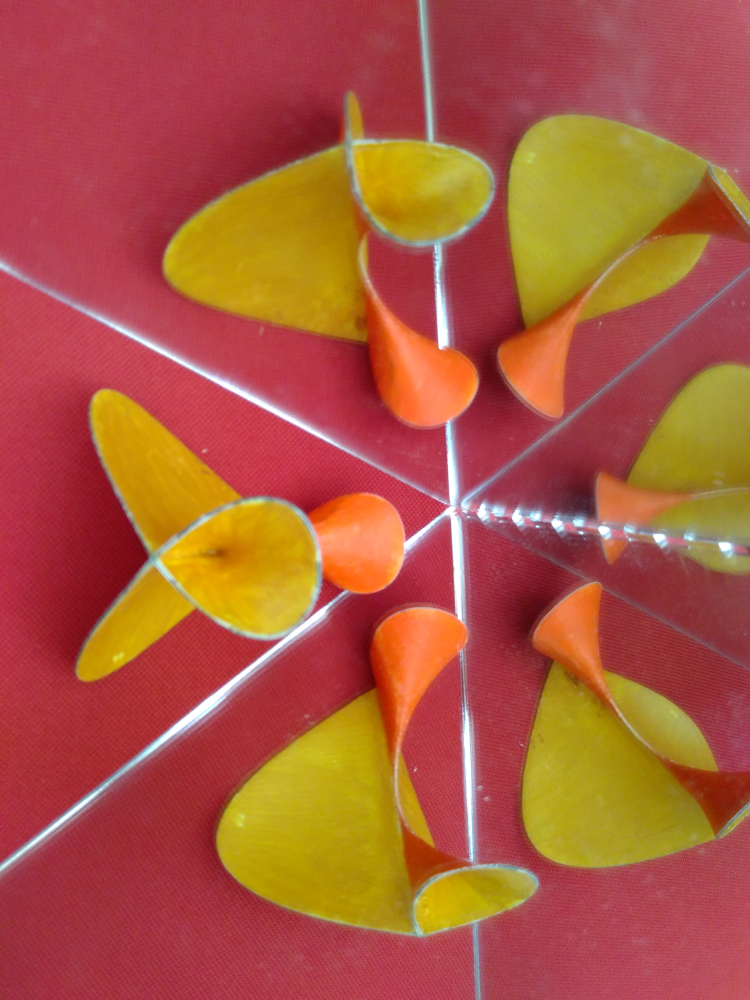{height=25%}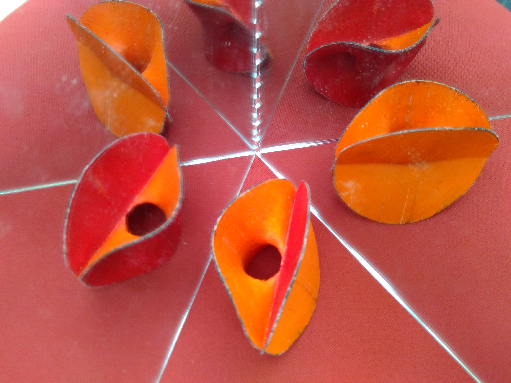{height=25%}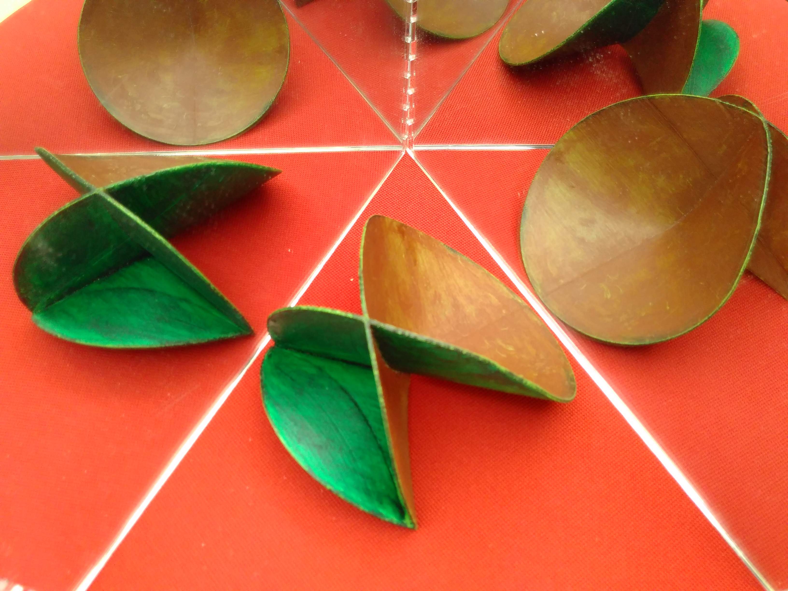{height=25%}{height=25%}\par\smallskip

But  
:   Des méthodes pour automatiser ou semi-automatiser la production de larges catégories d'objets : surfaces algébriques, surfaces minimales, objets fractals, arbres, pavages, *... mais aussi reproduction d'objets historiques.*

## Génération de maillages 2
### Adaptation de formes - le problème du zoom

Contexte  
:   Nombreux objets de musées numérisés en 3D.

Problème  
:   Les représenter beaucoup plus grands que nature.

\smallskip\centering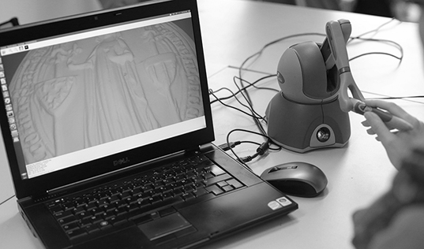{height=60%}\par\smallskip

Idée  
:   Raffiner le maillage *en s'adaptant à l'exploration de l'utilisateur*.

## Génération de maillages 3
### Adaptation de formes - projection sur des surfaces

Contexte  
:   On veut projeter une image ou une vidéo.

Problème  
:   La surface de projection ne correspond pas\
à la surface "naturelle" de la vidéo.\strut

\smallskip\centering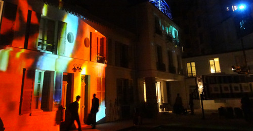{height=50%}\par\smallskip

Idée  
:   Déformer le maillage *en s'adaptant au contexte de l'utilisateur*.

## Analyse de nuages de points 
### À la recherche des équations perdues 

Contexte  
:   Objets illustrant des idées mathématiques.

Problème  
:   Description incomplète.

But  
:   Compléter la description pour reproduire l'objet.

\smallskip\centering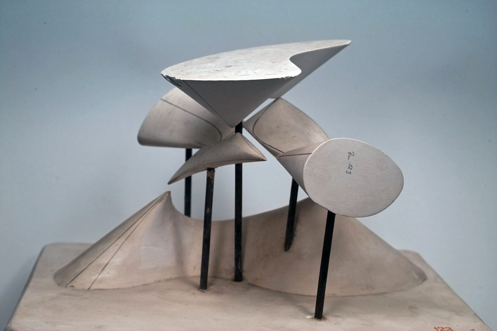{height=25%} 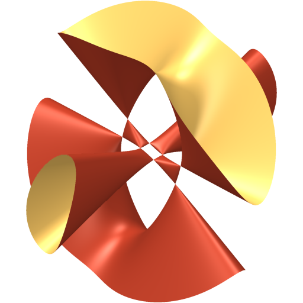{height=25%} 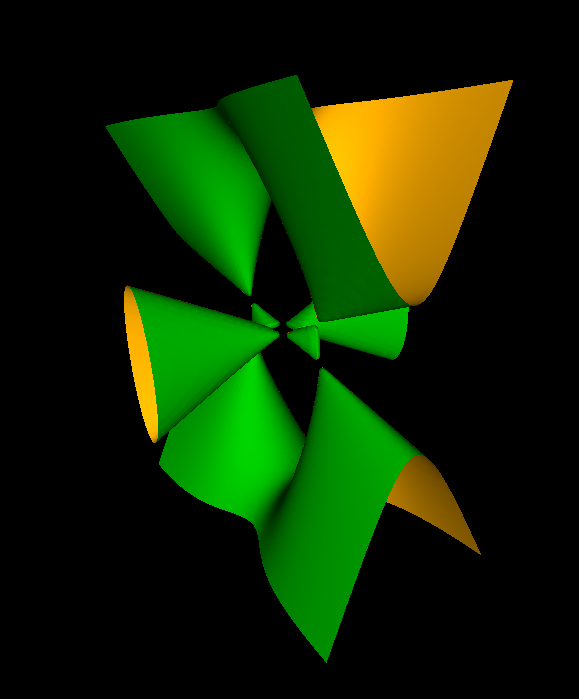{height=25%} ${}$ ${}$ ${}$ ???\par\smallskip

Idée  
:   Numériser puis analyser.

## Réparation de maillages
### Subtilités de la fabrication additive

Contexte  
:   Imprimer un objet 3D de source externe.

Problème  
:   Maillage défectueux.

But  
:   Réparer le fichier pour une impression de qualité.

\smallskip\centering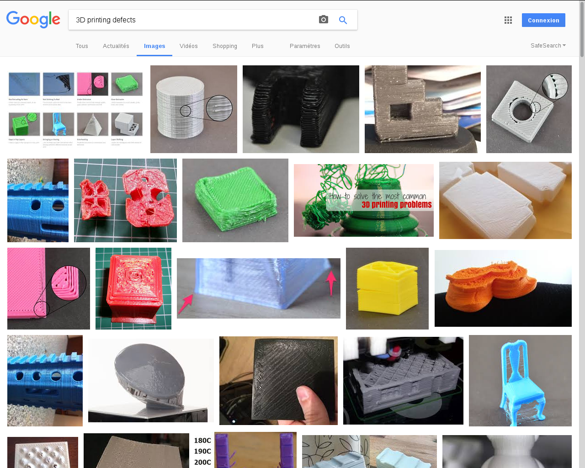{height=60%}\par\smallskip

## Maillages volumiques 
### Polyèdres à surface minimale

Question  
:   Quelle configuration de $n$ points dans l'espace minimise la surface de leur enveloppe convexe à volume fixé?

Réponse  
:   Akiyama donne la réponse pour $n=4$ à $12$ en 2017.

\smallskip\centering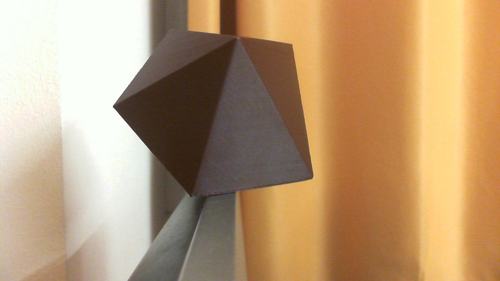{height=25%}\par\smallskip

Questions  
:   Que se passe-t-il pour $n$ grand? Y a-t-il des formes de faces qui se repètent? Peut-on paver l'espace avec ce type de polyèdres?

## Expérience d'enseignement

**>600h** dont 192h responsable de cours

|         |                  |    |    |  
|:--------|:-----------------|:---|:---|
|2016-2017|U Paris 8 (192h)  |info|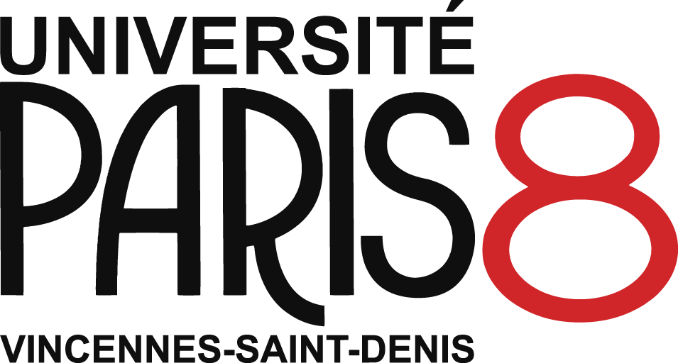{height=5%}|
|2015-2016|U Paris-Sud (192h)|math|{height=5%}|
|2014     |U Paris-Sud (96h) |math|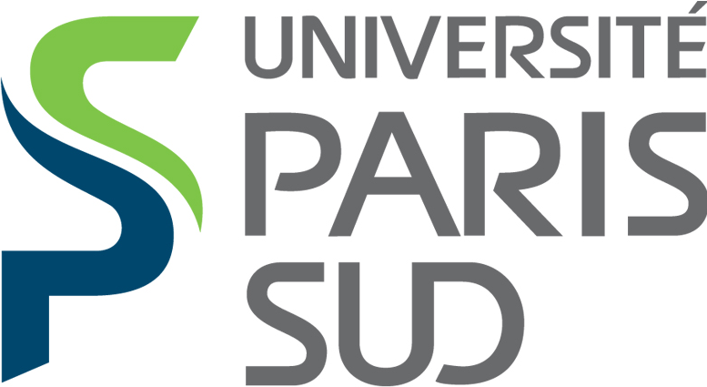{height=5%}|
|2008     |UNI (192h)        |math|{height=5%}|

## Cours, cours intégrés, TD

* Équations différentielles
* Mathématiques numériques avec Python
* Calculus
* Analyse
* Calcul formel avec SageMath
* Structures algébriques
* CMS avec Wordpress
* Algèbre linéaire
* Calcul vectoriel
* Calcul intégral
* Programmation orientée objet avec Java

## Facultés d'adaptation

* Programme du lycée très différent du mien
    * j'ai étudié les programmes (EduScol)
* Cours de maths numériques sans ordinateurs
    - Python sur smartphone (console Android)
* Étudiants d'origines diverses
    - je peux enseigner en français, anglais, espagnol, polonais
* ...

## Adaptation à l'enseignement de l'UTT

Pour les étudiants en alternance:

- j'ai déjà encadré un étudiant géomaticien de Paris 8 en alternance à l'Établissement Français du Sang
- j'ai déjà enseigné deux cours en utilisant CoCalc, une plateforme collaborative en ligne qui se prête bien à la pédagogie inversée

UEs LO13 "Infographie 3D : théorie et applications":

- passion de l'impression 3D
- curiosité vis-à-vis de la réalité virtuelle

Respect de l'apprenant

## Proposition de projet tutoré

|             |              |             |
|:------------|:------------:|------------:|
|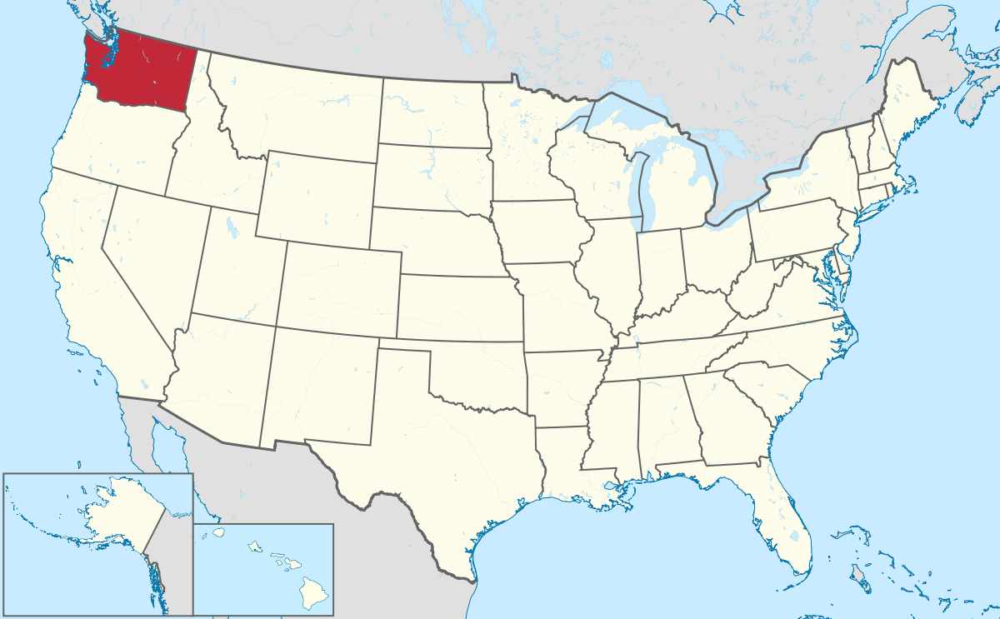{height=25%}|$\longleftrightarrow$|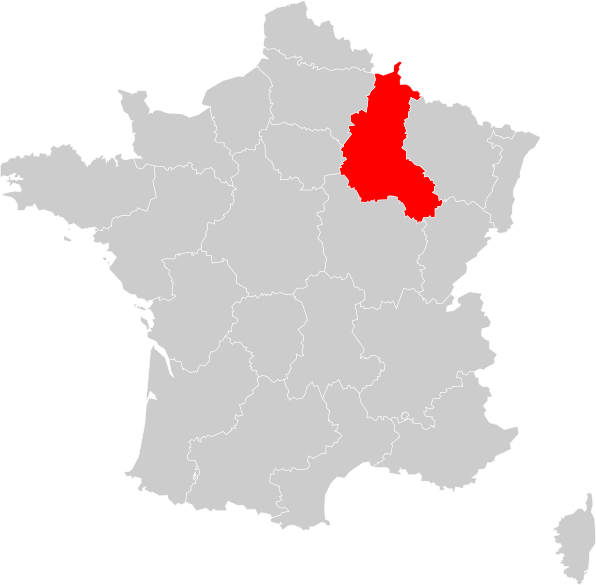{height=25%}|
|U. Washington|              |UTT          |
|3-4 students |              |3-4 étudiants|
|J. Athreya   |              |A. Málaga    |

## Expérience en entreprise

Stage de 2e année à La Défense, 2012
  
\centering 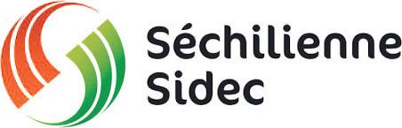{height=10%}\par

Développeuse freelance chez BlueRidge Logiciels, 2016

\centering 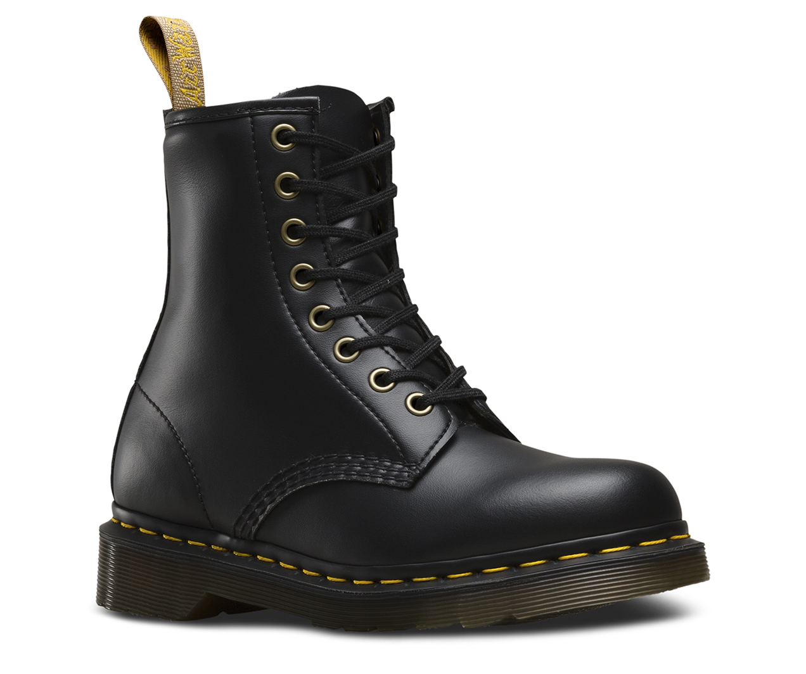{height=20%}\par

## Networking/réseau

Environnements startups / université / makers

|Tiers-lieux        |Fabrication numérique|Meetups|
|:------------------|:------------------|:------------------|
|Réso-nance         |LFO                |Ladies of code     |
|Proto204           |Small Lab          |Le Wagon           |
|e-sas              |Fablab Digiscope   |Wolfox             |
|                   |X-F4B              |...                |
|                   |Carrefour numérique|                   |
|                   |...                |                   | 

## Les responsabilités administratives

Faire vivre le département

- stages
- projets tutorés
- emplois du temps
- forums
- admissions
- portes ouvertes

\centering 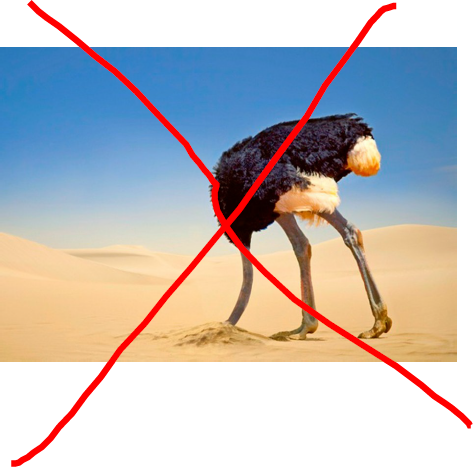{height=25%} \par

Actions de sensibilisation

- fête de la Science
- nuit des chercheurs

## La médiation scientifique

* médiation autour de projets art-science
    – « La lumière ne s'arrête pas là »
    – « Premières intimités de l'être »
    – « Turbulent »

\centering{height=15%}{height=15%}\par
	
* IMAGINARY France
    – plus de 100 heures face au grand public
    – 10 événements organisés ; une rencontre autour des plateformes de partage
    – résautage actif : incitation à de nouvelles contributions, gestion des bénévoles

\centering{height=25%}\par

	
## La recherche de fonds
### Blocage et illumination

\centering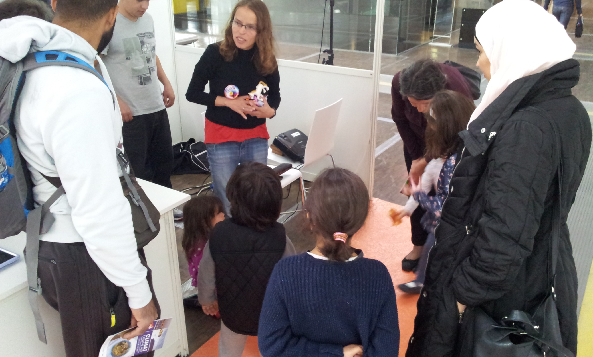{height=20%}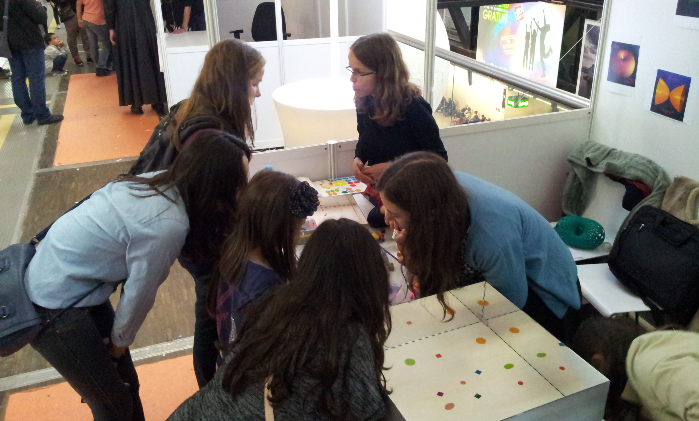{height=25%}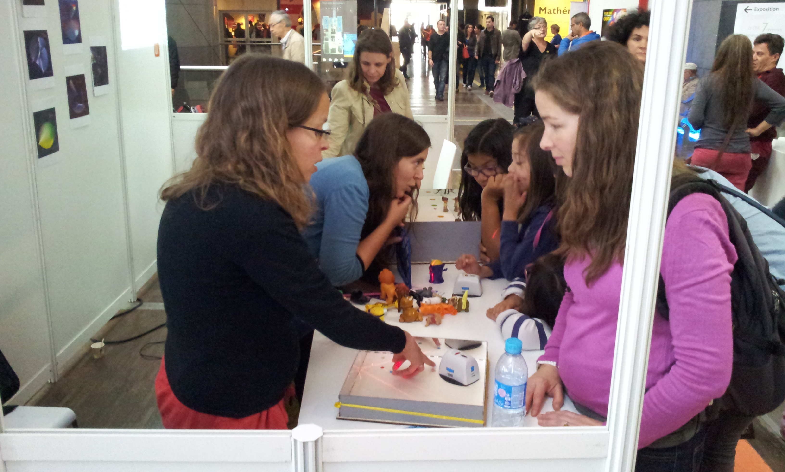{height=20%}\par

* représentation interactive d'un théorème récent sur les billards
* collaboration avec Samuel Lelièvre
* financement:\
  La Diagonale Paris-Saclay, Fondation Blaise Pascal

## Questions ?

|                                                   |                                                |                                                        |
|-------------------------------------------|----------------------------------------|-----------------------------------------|
|parcours mixte math-info           |vrai souci de l'accessibilité  |fan de logiciels libres|
|                                                   |                                                |                                                        |
|intérêt en médiation scientifique|grand respect pour les étudiants|continuité et ouverture dans la recherche|
|                                                   |                                                |                                                        |
|facilités de contact                     |fibre «maker»|compétences techniques|

J'ai à cœur de m'intégrer dans la recherche chez Gamma3\
et dans l'enseignement à l'UTT.

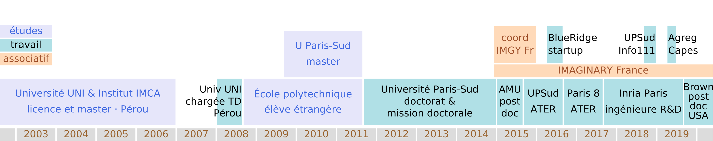{width=100%}
